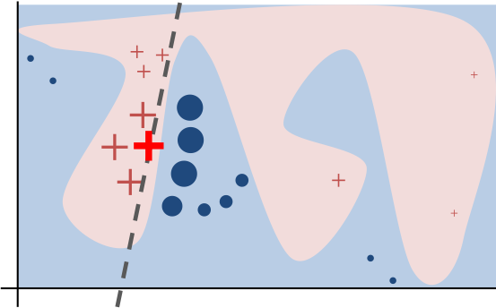
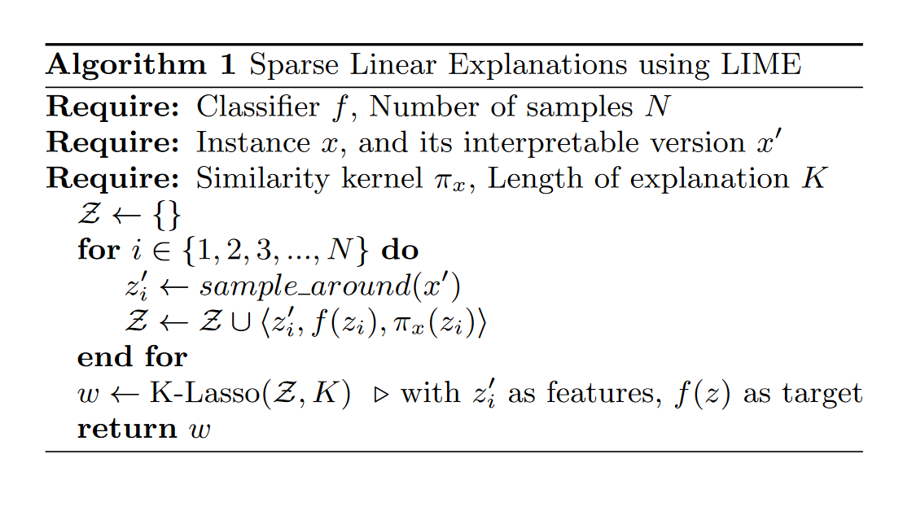

```{r setup, include=FALSE}
knitr::opts_chunk$set(
  echo = FALSE,
  eval = TRUE,
  warning = FALSE,
  message = FALSE)

library(knitr)
library(tidyverse)
```

# Motivation

- some models combine data in non-linear ways
- still want to know what's going on

```{r, echo = FALSE, eval = TRUE, out.width = "4in"}
include_graphics("neural_net.jpg")
```

# How to explain a model where $f$ is complex?

$X \in \mathbb{R}^{n, p}$ is a data matrix of $n$ points in $p$ space  
$f: \mathbb{R}^p \to \{1, 2, ..., K\}$ is a classification model

1. Create a binarized and interpretable version of data (called $X'$)
2. Approximate $f$ locally with an interpretable model fit to $X'$

Multiclass classification treated as $K$ binary classification problems, $K$ the number of classes

# Creating interpretable data $X'$

Original:

```{r}
iris <- as_tibble(iris)
head(iris)
```

Interpretable:

- Categorical features: one-hot/dummy coding
- Continuous features: effect of value being in a certain range
- Other binary features also good! Presence/absence of shapes in image, sequences in text, etc...  

# Fitting a local approximation: general setting

explainer = $\mathrm{argmin}_{g \in G} \; \mathcal{L}(f, g, \pi_x) + \Omega(g)$

- $f(x)$ is the probability that observation $x$ belongs to a particular class given model $f$
- $G$ is some class of easily understandable models
- $\mathcal{L}(f, g, \pi_x)$ is a loss function
- $\pi_x$ is a weighting function that gives higher weights to data close to $x$
- $\Omega(g)$ is some measure of the complexity of $g$

The `explainer` is an easily understood model where all inputs are binary! It is only locally valid!

# The actual estimation process

1. Sample $N$ (typically ~5000) data points from $X$ weighted by $\pi_x$

```{r, echo = FALSE}

```

2. Turn these into interpretable data vectors $X'$
3. Fit an understandable model (i.e. LASSO) on $X'$ with response $f(X)$


# Get to the darn code already

```{r, echo = TRUE}
library(lime)
library(caret)

 # create train/test sets
iris_train <- slice(iris, 5:n())
iris_test  <- slice(iris, 1:4)

# fit random forest
model <- train(Species ~ ., iris_train,
               method = 'rf')  

# fit explainer object
explainer <- lime(iris_train, model)
```

# More code

```{r, echo = TRUE}
# explain observations!
explanation <- explain(iris_test,
                       explainer,
                       n_labels = 1,
                       n_features = 4)

# plot_features(explanation)  -- results on next slide
```

# Visual explanations

```{r}
plot_features(explanation)
```

# What is this good for?

- you now have an approximation $g$ of $f$
- you can understand $g$

However:

- you have no idea how good the approximation is
- *key*: $g$ **does not** explain what data is causing what response in $f$

My take: use for diagnostics and intuition only.

- is my model doing something really stupid?
- is there an obvious bias in my model?

# `lime` R just works with models from:

- `caret`
- `mlr`
- `xgboost`
- `h2o`
- `keras`

Easy to extend to other packages. Can also explain image and text classifications! 

Anything you can send into a neural net and get class probs out of you can explain!

# Questions?

The original paper: ["Why Should I Trust You?": Explaining the Predictions of Any Classifier](https://arxiv.org/abs/1602.04938)

Generalization of LIME: [A Unified Approach to Interpreting Model Predictions](https://arxiv.org/abs/1705.07874)

@alexpghayes on Twitter  
alexpghayes@gmail.com

# Sparse Linear Explanations

```{r, out.width = "4in"}

```

`K-Lasso`: Use RMSE weighted by $\pi_x$ as loss. Select top $K$ predictors with LASSO. Put these into OLS for final explainer.
