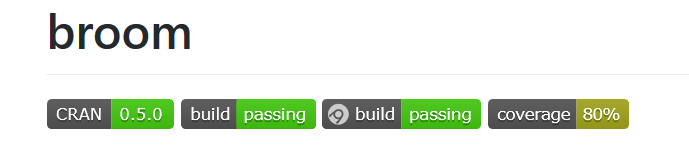
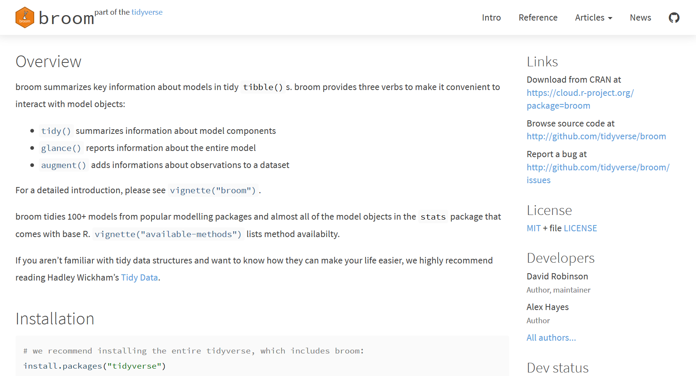
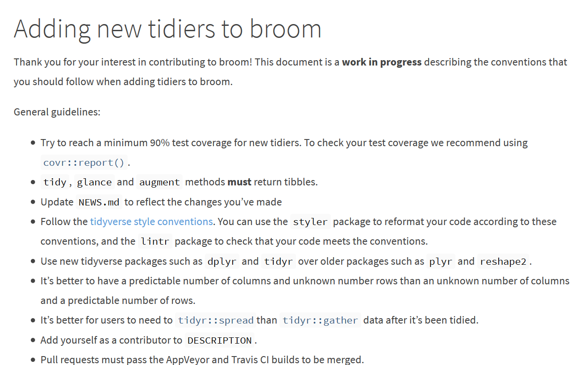
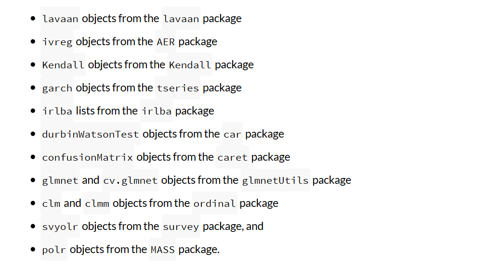
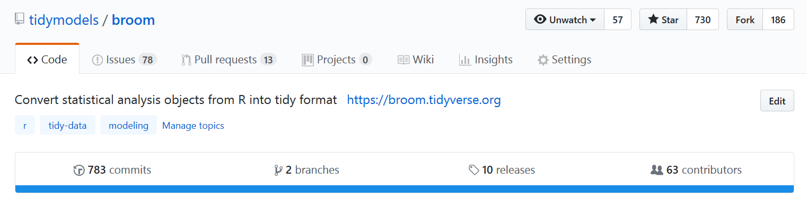
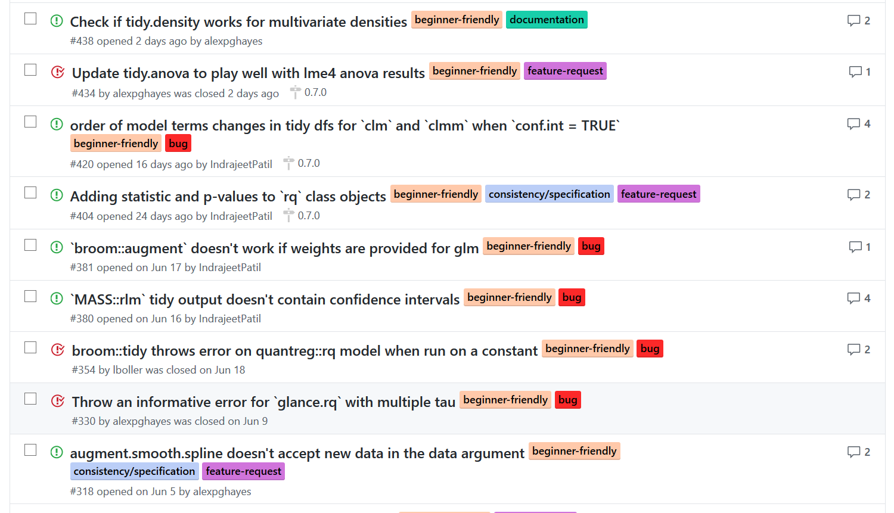
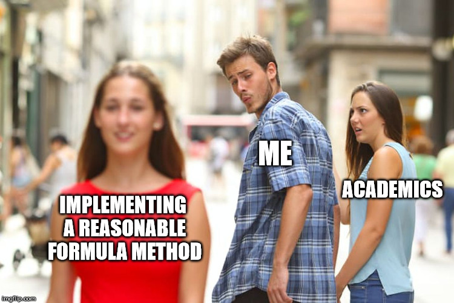

```{r setup, include = FALSE}
knitr::opts_chunk$set(echo = TRUE, warning = FALSE, message = FALSE)

library(tidyverse)
library(broom)

options(tibble.print_max = 3, tibble.print_min = 3)
```

## Outline

1. What is `broom`?
1. `broom 0.5.0` release
1. Lessons learned
1. Moving forward

# What is `broom`?

## `broom` tidies model objects

**Input**: model object

**Output**: tidy tibble

- `tidy()` summarizes information about model components
- `glance()` reports information about the entire model
- `augment()` adds informations about observations to a dataset

## Usage

```{r}
fit <- lm(hp ~ ., mtcars)

tidy(fit)
glance(fit)
```

# `broom 0.5.0`

## `broom 0.5.0`: new features

- Tibble output
- New test suite
- New function documentation
- New vignette
- New tidiers
- Many bug fixes
- Many deprecations

## `broom 0.5.0`: tibble output

```{r}
tidy(prcomp(iris[, 1:4]), matrix = "d")
```

## `broom 0.5.0`: tibble output

This was a breaking change. Common issues:

- subsetting with `[` and expecting a vector.
- setting rownames on a tibble.
- using augment on models making use of matrix covariates / outcomes.
    - i.e. `survival::Surv()`
    
Broom has 92 reverse dependencies. This (plus deprecations) broke 15 of them.

## `broom 0.5.0`: new test suite

```{r, echo = FALSE, out.width = "4in", fig.align = "center"}

```

- Line coverage: $40\% \to 80\%$ 
- Higher in practice since we skip deprecated tests
- Revived the Travis CI build

## `broom 0.5.0`: what gets tested

Test that

- `tidy()`, `glance()`, and `augment()` return tibbles.
- `glance()` returns a single row.
- Occasionally check dimensions of output

```{r, eval = FALSE}
fit <- lm(hp ~ ., mtcars)
td <- tidy(fit)
check_tidy_output(td)
```

## `broom 0.5.0`: new function documentation

- Gave each function it's own roxygen
    - Had started to document too much in one place
- Heavily cross-linked and aliased new docs
- Users requested more explicit doc for stuff like:

```{r, eval = FALSE}
#' @rdname augment.lm
#' @export
augment.glm <- augment.lm
```

## `broom 0.5.0`: dealing with repeated documentation

Many repeated arguments:

```{r, eval = FALSE}
tidy.betareg <- function(x,
  conf.int = FALSE,
  conf.level = .95, ...)

tidy.ivreg <- function(x,
  conf.int = FALSE,
  conf.level = .95,
  exponentiate = FALSE, ...)
```

Should share documentation for `conf.int`.

## `broom 0.5.0`: `roxygen2 @template`s

`roxygen2` templates make this easy:

```
@template param_confint
```

Where `man-roxygen/param_confint.R` looks like:

```
#' @param conf.int Logical indicating
#'   whether or not to include a
#'   confidence interval in the tidied
#'   output. Defaults to `FALSE`.
#' @md
```

## `broom 0.5.0`: what is templated

Templates currently used to generate:

- `@title`,
- `@description`,
- `@params`, and
- some `@return`

documentation sections.

## `broom 0.5.0`: new README + `pkgdown` site

```{r, echo = FALSE, out.width = "4in", fig.align = "center"}

```

## `broom 0.5.0`: new vignette

```{r, echo = FALSE, out.width = "4in", fig.align = "center"}

```

## `broom 0.5.0`: new tidiers


```{r, echo = FALSE, out.width = "4in", fig.align = "center"}

```

## `broom 0.5.0`: Bug fixes and pull requests

Start of internship: 134 issues, 34 pull requests

- Triaged two year backlog of issues
- Closed ~80 issues
- Merged 40 pull requests

Current status:

```{r, echo = FALSE, out.width = "4in", fig.align = "center"}

```

## `broom 0.5.0`: Bug fixes and pull requests

- Contributors are enthusiastic and fun to work with
- Lots of issues, but generally easy to fix
- *Beginner Friendly* tag has been immensely popular:

```{r, echo = FALSE, out.width = "4in", fig.align = "center"}

```

## `broom 0.5.0`: deprecations: tidy statistical objects only

- Some people were using `broom` like `as_tibble()`
- Deprecations to prevent this:

    - `tidy.data.frame()`
    - `tidy.matrix()`
    - `tidy.numeric()`
    - `tidy.character()`
    - `tidy.logical()`

## `broom 0.5.0`: soft deprecations: mixed models

Due to high maintanence burden, moving tidiers for 

- lme, lme4 and nmle models,
- brms models,
- rstanarm models, and 
- mcmc objects

to Ben Bolker's `broom.mixed` (hopefully on CRAN soon).

# Lessons learned

## Lesson: writing and sanity checking tidiers is hard

```{r, echo = FALSE, out.width = "1.75in", fig.align = "center"}


```

## Lesson: `broom` depends on high quality PRs

```{r, echo = FALSE, out.height = "0.75in", out.width = "3in", fig.align = "center"}
knitr::include_graphics("figures/broom_contributors.jpg")
```

**Key: empower contributors to make high quality PRs**

- Document behavioral expectations for tidying methods
- Provide consistent documentation
- Automate as much as possible in tests

**Merge now, fix later**: community involvement far more important than perfect code

## Lesson: `augment()` is hard

Original thought: `tidy()` is most ambiguous method, will be hardest to work with

Incorrect: `augment()` is hard

- Need different behavior for `data` and `newdata` args
- People often don't implement it
- Have to deal with model both model input and output

## Lesson: there are many ways to represent a model

Representations of a fit model:

- Mathematical: $y \sim \mathcal N(X \hat \beta, \sigma^2)$
- Code object: `fit <- lm(hp ~ . , mtcars); fit`
- Relational: `tidy(fit), glance(fit), augment(fit)`
- ???

Opinion: need a *tidy modelling* paper to clarify the key objects in play like *tidy data* did

# Moving forward

## What's happening next

- More tools for contributors
- More deprecations
- Integrating `broom` and friends into `tidymodels`
- I will likely take over as `broom` maintainer

## Tools for contributors: tests for argument names

```{r, eval = FALSE}
check_arguments(tidy.lm)
```

- Checks arguments against master list
- Checks default arguments
    - Shouldn't be missing
    - `conf.int = FALSE`
    - `conf.level = 0.95`
    - `conf.int` and `conf.level` always come as a pair
- Tests written, but not yet passing
    
Goal: enforce consistency, especially in new PRs

## Tools for contributors: tests for column names

```{r}
library(lavaan)

cfa.fit <- cfa(
   'F =~ x1 + x2 + x3 + x4 + x5',
   data = HolzingerSwineford1939, group = "school"
)

select(glance(cfa.fit), 1:5)
```

## Tools for contributors: `column_glossary` approach

- Describe acceptable column names in `tidy.yaml`:

```
- column: AIC
  description: Akaike's Criterion.
  used_by:
    - ivreg
```

- Compile `tidy.yaml` into a `column_glossary` tibble
- Export `column_glossary` (downstream package maintainers have asked for this)
- Test output column names against `column_glossary`
- Populate documentation from `column_glossary`
- Have a `@template` prototype, Hadley suggested `@evalRd` instead

## Tools for contributors: more vignettes

- Second draft of *Adding new tidiers* vignette
    - Detailed and explicit behavioral specification
    - Will write tests for as many of these as possible
- New vignette on adding tidiers to packages other than broom
    - Based on reexport generics from `modelgenerics`
    
## More deprecations

- Hard deprecate mixed model tidiers in favor of `broom.mixed`
- Soft deprecate time series tidiers in favor of `sweep`
- `tidy.table()`
- `tidy.ftable()`
- etc

## `tidymodels` integration: vision

- Finish any missing aspects of the tidier behavior specification
- Document this clearly
- Develop tests for as much fo the spec as possible
- Reach out to package maintainers working on similar packages
- Invite them to join `tidymodels` once they meet the spec
- Some system for keeping track of where tidiers live
- Potentially break boom into smaller pieces

```{r, eval = FALSE}
library(tidymodels)  # load everything
```

## `tidymodels` integration: possible collaborations

- `sweep`: time series
- `tidytext`: natural language processing
- `broomstick`: trees
- `broom.mixed`: mixed models, bayesian models
- `biobroom`: bioconductor objects
- `schoenberg`: gams
- `tidybayes`: bayesian models
- `broom.base`: broom infrastructure
- `mlbroom`: doesn't exist yet but demand seems high

## Priorities for the next 3 weeks

1. Vignette on addings tidiers to packages other than broom
1. Infrastructure for auto-building `@return` documentation
1. Write `tidy.yaml`, `glance.yaml` and `augment.yaml`
1. Move time series stuff into sweep
1. Reach out to potential collaborators
1. Make sure existing tidiers meet behavioral specification

## Questions?

Read more about [broom 0.5.0 release](https://www.tidyverse.org/articles/2018/07/broom-0-5-0/) on the tidyverse blog.

You can follow broom development on our [Github page](https://github.com/tidyverse/broom/).

@alexpghayes on Twitter  
alexpghayes@gmail.com

# Appendix

## `broom 0.5.0`: matrix column and augment example

```{r, eval = FALSE}
y <- rnorm(5)
x <- matrix(rnorm(10), nrow = 5)

df <- data.frame(x, y)  # ok
tibble::tibble(x, y)    # errors

fit <- lm(y ~ x, df)    # problem: this works
augment(fit)            # this goes kaboom
```

Passing `data` argument can help:

```{r, eval = FALSE}
augment(fit, data = df)  # happy again
```

## Aside: model coverage

```{r, eval = FALSE}
# glance.arima coverage was 100 percent.
# tested output of:
glance(arima(lh, order = 1:3))

# but this was broken until recently:
glance(arima(lh, order = 1:3, method = "CSS"))
```

- Same class can correspond to many varied model objects
- Hard to write varied tests for unfamiliar model objects

## Aside: arguments disappearing into `...`

```{r}
fit <- lm(hp ~ ., mtcars)

# misspelled argument
td <- tidy(fit, conf.int = TRUE, comf.level = 0.9)

# no error, output looks exactly like
# you might expect
```
