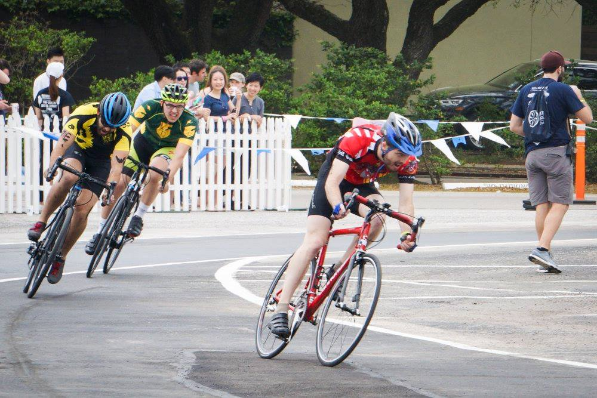
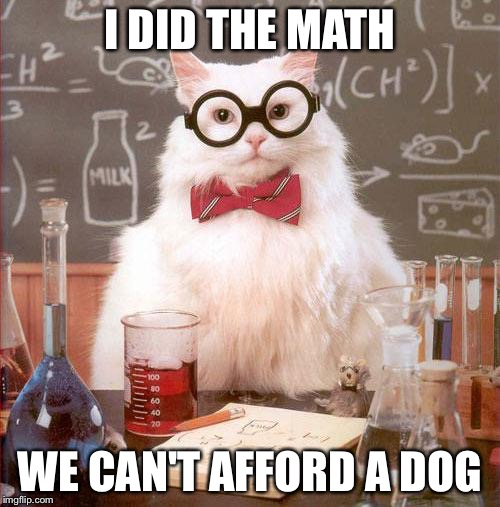
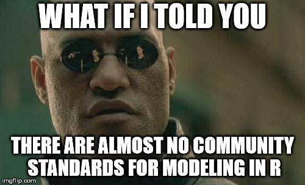

```{r setup, include = FALSE}
knitr::opts_chunk$set(
  collapse = TRUE,
  echo = TRUE,
  warning = FALSE,
  message = FALSE,
  fig.align = "center"
)

library(tidyverse)
library(broom)

set.seed(27)
options(tibble.print_max = 3, tibble.print_min = 3)
theme_set(theme_gray(base_size = 22))
```

# Who am I?

## About Me

```{r echo = FALSE, out.width = "2.5in", out.height = "1.5in"}

```

- Summer intern at RStudio last summer
- Primary maintainer of the [`broom`](https://broom.tidyverse.org/) package
- Just started a PhD in Statistics at UW-Madison
- Active on #rstats Twitter and Github

# Statistical models: some vocabulary

## Example: the normal model

$$
y_i \stackrel{\mathrm{iid}}{\sim} \mathrm{Normal}(\mu, \sigma^2)
$$

Here $\theta = (\mu, \sigma^2)$ and the parameter space is $\mathbb R \times \mathbb R^+$.

## Visualizing the normal model

A model is a *set*.

\begin{center}
\begin{tikzpicture}
	\draw[smooth cycle, thick, tension=0.7] plot coordinates{(2, 1.8) (-1,0) (.6, -1.2) (3,-2) (5,1)};
	\node at (2, 2.3) {Model};
	
	\draw [fill] (3, 1) circle [radius=0.05];
	\node [below] at (3, 1) {$y_i \sim \mathrm{Normal}(-2, 1)$};
	
	\draw [fill] (1, 0) circle [radius=0.05];
	\node [below] at (1, 0) {$y_i \sim \mathrm{Normal}(3, 10)$};
\end{tikzpicture}
\end{center}

We call a single element of a model a **fit**. The distribution with $\mu = -2, \sigma^2 = 1$ is a fit, for example. 

<!-- TODO: model -- parameter space isomorphism diagram -->

<!-- Each fit corresponds to one point in the parameter space. -->

## Another (parametric) example: the linear model

Given response $y$ and predictor variables $x_1$ and $x_2$, the linear model looks like:

$$
y_i = \beta_0 + \beta_1 x_{1i} + \beta_2 x_{2i} + \varepsilon_i \qquad
\varepsilon_i \stackrel{\mathrm{iid}}{\sim} \mathrm{Normal}(0, \sigma^2)
$$

This model says that $y$ is i.i.d with a mean that depends on $x$ and $\vec \beta$, and with fixed variance $\sigma^2$.

## Estimation

An **estimator** is a way to calculate the parameters of a model from data[^2]. They are many estimators for any given model, and which one we think is best depends on how we define "agrees best with the data."

[^2]: This is equivalent to selecting the best fit!

## Some estimators for the normal model

- $\displaystyle \hat \mu = 1 \qquad \quad \hat \sigma^2 = 10$

\vspace{2mm}

- $\displaystyle \hat \mu = {1 \over n} \sum_{i=1}^n x_i \qquad \hat \sigma^2 = {1 \over n} \sum_{i=1}^n (x_i - \bar x)^2$

\vspace{2mm}

- $\displaystyle \hat \mu = {1 \over n} \sum_{i=1}^n x_i \qquad \hat \sigma^2 = {1 \over n - 1} \sum_{i=1}^n (x_i - \bar x)^2$
  
## Visualizing estimation

\begin{center}
\begin{tikzpicture}
	\draw[smooth cycle, thick, tension=0.7] plot coordinates{(2, 1.8) (-1,0) (.6, -1.2) (3,-2) (5,1)};
	\node at (2, 2.3) {Model};
	
	\draw [fill] (3, 1) circle [radius=0.05];
	\draw [fill] (1, 0) circle [radius=0.05];
	\draw [fill] (2.3, -0.5) circle [radius=0.05];
	\draw [fill] (0.1, 0.2) circle [radius=0.05];
	\draw [fill] (2.8, 0.6) circle [radius=0.05];
	\draw [fill] (2, -1.7) circle [radius=0.05];
	\draw [fill] (0.9, -1) circle [radius=0.05];
	\draw [fill] (4, 1.1) circle [radius=0.05];
	\draw [fill] (3.5, 0.3) circle [radius=0.05];
	\draw [fill] (2.4, -1.6) circle [radius=0.05];
	\draw [fill] (-0.3, -0.05) circle [radius=0.05];
	\draw [fill] (3.2, -0.15) circle [radius=0.05];
	\draw [fill] (1.5, 1.4) circle [radius=0.05];
	
\end{tikzpicture}
\end{center}

## Visualizing estimation

\begin{center}
\begin{tikzpicture}
	\draw[smooth cycle, thick, tension=0.7] plot coordinates{(2, 1.8) (-1,0) (.6, -1.2) (3,-2) (5,1)};
	\node at (2, 2.3) {Model};
	
	\draw [fill] (3, 1) circle [radius=0.05];
	\draw [fill] (1, 0) circle [radius=0.05];
	\draw [fill, red] (2.3, -0.5) circle [radius=0.05];
	\draw [fill] (0.1, 0.2) circle [radius=0.05];
	\draw [fill] (2.8, 0.6) circle [radius=0.05];
	\draw [fill] (2, -1.7) circle [radius=0.05];
	\draw [fill] (0.9, -1) circle [radius=0.05];
	\draw [fill] (4, 1.1) circle [radius=0.05];
	\draw [fill] (3.5, 0.3) circle [radius=0.05];
	\draw [fill] (2.4, -1.6) circle [radius=0.05];
	\draw [fill] (-0.3, -0.05) circle [radius=0.05];
	\draw [fill] (3.2, -0.15) circle [radius=0.05];
	\draw [fill] (1.5, 1.4) circle [radius=0.05];
	
\end{tikzpicture}
\end{center}

## Estimates found!

\begin{center}
\begin{tikzpicture}
	\draw[smooth cycle, thick, tension=0.7] plot coordinates{(2, 1.8) (-1,0) (.6, -1.2) (3,-2) (5,1)};
	\node at (2, 2.3) {Model};
	
	\draw [fill] (3, 1) circle [radius=0.05];
	\draw [fill] (1, 0) circle [radius=0.05];
	\draw [fill, red] (2.3, -0.5) circle [radius=0.05];
	\draw [fill] (0.1, 0.2) circle [radius=0.05];
	\draw [fill] (2.8, 0.6) circle [radius=0.05];
	\draw [fill] (2, -1.7) circle [radius=0.05];
	\draw [fill] (0.9, -1) circle [radius=0.05];
	\draw [fill] (4, 1.1) circle [radius=0.05];
	\draw [fill] (3.5, 0.3) circle [radius=0.05];
	\draw [fill] (2.4, -1.6) circle [radius=0.05];
	\draw [fill] (-0.3, -0.05) circle [radius=0.05];
	\draw [fill] (3.2, -0.15) circle [radius=0.05];
	\draw [fill] (1.5, 1.4) circle [radius=0.05];
	
\end{tikzpicture}
\end{center}

\begin{center}
Best fit: $y_i \sim \mathrm{Normal}(-2, 1)$. Finally we can do inference!
\end{center}

## Do all the inference

```{r echo = FALSE, out.width = "70%"}

```

## Some intuition about models, estimators and fits

A **model** corresponds to a set of possible truths about the world. A **fit** is a single truth about the world. An **estimator** is a way to choose the truth most suggested by the data from a set of many possible truths.

# What problem does `broom` solve?

## Representing a fit in mathematical terms

Hopefully it feels natural to describe models mathematically

- Normal model: $y_i \sim \mathrm{Normal}(\mu, \sigma^2)$
- Fit from normal model: $y_i \sim \mathrm{Normal}(-2, 1)$
    - Can also identify fits by parameter vectors: $\theta = (-2, 1)$
- Estimators for normal model:
    - $\displaystyle \hat \mu = {1 \over n} \sum_{i=1}^n x_i \qquad \hat \sigma^2 = {1 \over n} \sum_{i=1}^n (x_i - \bar x)^2$

\vspace{1mm}
    
- Key: shared notation and community standards

## How does R represent models, estimators and fits?

```{r echo = FALSE, out.width = "\\textwidth"}

```

## A taste of the pain

Suppose you want class probabilities from a fit called `obj`:

|Object        |Code                                       |
|:-------------|:------------------------------------------|
|`lda`         |`predict(obj)`                             |
|`glm`         |`predict(obj, type = "response")`          |
|`gbm`         |`predict(obj, type = "response", n.trees)` |
|`mda`         |`predict(obj, type = "posterior")`         |
|`rpart`       |`predict(obj, type = "prob")`              |
|`Weka`        |`predict(obj, type = "probability")`       |
|`logitboost`  |`predict(obj, type = "raw", nIter)`        |
|`pamr.train`  |`pamr.predict(obj, type = "posterior")`    |

## How am I supposed to keep track of all this!?

```{r echo = FALSE, out.width = "\\textwidth"}
knitr::include_graphics("figures/meme_frustration.jpg")
```

## The model representation problem

\large

We have no shared framework or understanding of how to represent statistical models, estimation methods and fits with R objects.

## Aside

- People who write and share code to enable data analysis are awesome
- This isn't anyone's fault
- Trying to get things done can still be frustrating

# The `broom` package

## The scene

Say we:

1. pick a model,
2. pick an estimator for that model, and then
3. get an R object `fit` using that estimator.

- The `fit` object is different for every model.
- The `fit` object could be great to work with, or awful.

## `broom` provides a standard way to represent **fits**

`broom` treats fits as having three parts:

1. A table of information about fit parameters
2. A table of information about each observation used to estimate the fit
3. A table of overall goodness-of-fit measures

- Each of table reported as a tidy `tibble`.
- Together these constitute a "tidy" representation of a fit.

## Continuing with the normal model example

```{r}
# simulate Normal(-2, 1) data
x <- rnorm(5000, -2, 1)

# create a fit object using
# MLE estimator and normal model
normal_fit <- MASS::fitdistr(
  x,      
  dnorm,  # use the normal model!
  start = list(mean = 0, sd = 1)
)
```

## What is `normal_fit`?

```{r}
str(normal_fit)
```

## The `broom` generics

So how do we turn fits into tidy tibbles?

- `tidy()` summarizes information about fit components
- `glance()` reports information about the entire fit
- `augment()` adds information about observations to a dataset

## What is the tidy representation of `normal_fit`?

```{r}
library(tidyverse)
library(broom)

tidy(normal_fit)
```

## What is the tidy representation of `normal_fit`?

```{r}
glance(normal_fit)
```

There's no `augment()` method defined for univariate distributions at the moment.

## Another example: the linear model

```{r}
# create a fit object using the
# OLS estimator for the linear model
ols_fit <- lm(hp ~ mpg + cyl, mtcars)

# try the following for yourself:
```

```{r eval = FALSE}
str(ols_fit)
```

## The tidy representation of `lm` objects

```{r}
tidy(ols_fit)
```

## The tidy representation of `lm` objects

```{r}
glance(ols_fit)[, 1:5]
```

## The tidy representation of `lm` objects

```{r}
augment(ols_fit)[, 1:7]
```

## Notes about the tidy representation

- Always get a tibble back
- Column names in returned tibbles are consistent

- Some information in the original R object is lost

<!-- Why is the tidy representation useful? -->

# Use cases

## Report model coefficients with `tidy()`

```{r}
kable2 <- function(data)
  knitr::kable(mutate_if(data, is.numeric, round, 2))

tidy(ols_fit) %>% 
  kable2()
```

## Plot histograms/densities of p-values

```{r}
fit <- lm(mpg ~ ., mtcars)
td <- tidy(fit)

p <- ggplot(td, aes(p.value)) +
  geom_density(
    fill = "skyblue", color = "skyblue", alpha = 0.7
  ) +
  labs(
    title = "Density of p-values for regression coefficients",
    x = "P-value",
    y = "Density"
  )
```

## Plot histograms/densities of p-values

```{r echo = FALSE, out.width = "90%"}
p
```

## Comparing models by goodness of fit measures

```{r}
fits <- list(
  fit1 = lm(hp ~ cyl, mtcars),
  fit2 = lm(hp ~ cyl + mpg, mtcars),
  fit3 = lm(hp ~ ., mtcars)
)

gof <- map_df(fits, glance, .id = "model") %>% 
  arrange(AIC)
```

## Comparing models by goodness of fit measures

```{r}
select(gof, -c(2:7))
```

## Inspecting residuals from multiple linear regression

```{r}
fit <- lm(hp ~ ., mtcars)
au <- broom::augment(fit)

p <- au %>% 
  gather(x, val, -contains(".")) %>%
  ggplot(aes(val, .resid)) +
  geom_point() +
  facet_wrap(~x, scales = "free") +
  labs(x = "Predictor value", y = "Residual") +
  theme(axis.text.x = element_blank(),
        axis.ticks.x = element_blank())
```

## Inspecting residuals from multiple linear regression

```{r echo = FALSE, out.width = "90%"}
p
```

## Bootstrapping

```{r echo = FALSE, out.width = "90%"}
ggplot(mtcars, aes(wt, mpg)) +
  geom_point()
```

## Bootstrapping

Consider a model:

$$\texttt{mpg} = {k \over \texttt{wt}} + b + \varepsilon, \quad \varepsilon \sim \mathrm{Normal}(0, \sigma^2)$$

Suppose we want to know the sampling distributions of $k$ and $b$ via bootstrapping

## Bootstrapping

```{r}
library(rsample)

boots <- bootstraps(mtcars, times = 100)
boots

boots$splits[[1]]

analysis(boots$splits[[1]])
assessment(boots$splits[[1]])

boots
```

## Bootstrapping

```{r}
fit_nls_on_bootstrap <- function(split) {
  nls(
    mpg ~ k / wt + b,
    analysis(split),
    start = list(k = 1, b = 0)
  )
}

fit_nls_on_bootstrap(boots$splits[[1]])
```

## Bootstrapping

```{r}
boot_fits <- boots %>% 
  mutate(fit = map(splits, fit_nls_on_bootstrap),
         coef_info = map(fit, tidy))

boot_fits
```

## Bootstrapping

```{r}
boot_coefs <- boot_fits %>% 
    unnest(coef_info)

boot_coefs
```

## Bootstrapping

```{r }
p <- ggplot(boot_coefs, aes(estimate)) + 
  geom_histogram(binwidth = 2) + 
  facet_wrap(~ term, scales = "free") +
  labs(
    title = "Sampling distributions of k and b",
    y = "Count",
    x = "Value"
  )
```

## Bootstrapping

```{r echo = FALSE, out.width = "90%"}
p
```

## Bootstrapping

```{r}
boot_aug <- boot_fits %>% 
  mutate(augmented = map(fit, augment)) %>% 
  unnest(augmented)

p <- ggplot(boot_aug, aes(wt, mpg)) +
  geom_point() +
  geom_line(aes(y = .fitted, group = id), alpha = 0.2)
```

## Bootstrapping

```{r echo = FALSE, out.width = "90%"}
p
```


## General strategy

`broom` provides tidying methods for 100+ classes!

1. Put fits in a list, or a list-column of a `tibble`
2. Use `purrr::map()` to apply `tidy()`, `glance()` or `augment()` to each fit
3. Use `tidyverse` tools to manipulate and visualize resulting data!

# Next steps and `tidymodels`

## Next steps for `broom`

General projects

> - Continue to standardize naming throughout package
> - Cleanup of internals

Possible new generics

> - Opinionated tidying methods: return only statistical sound measures
> - Generic to translate a code object into LaTeX (it's mathematical representation)?

## `tidymodels`

$\begin{array}{l} \includegraphics{figures/tidymodels_logo.png} \end{array}$
[https://github.com/tidymodels/tidymodels](https://github.com/tidymodels/tidymodels)

A general attempt to make modeling in R more consistent and tidy. Lots of [big projects](https://github.com/orgs/tidymodels/projects). Highlights:

> - [best practices for developing modeling packages](https://tidymodels.github.io/model-implementation-principles/)
> - [`parnsip`](https://topepo.github.io/parsnip/): standardized modeling interfaces (in progress)
> - [`recipes`](https://tidymodels.github.io/recipes/): data pre-processing
> - [`rsample`](https://tidymodels.github.io/rsample/): infrastructure for resampling

## Questions?

Read about the recent `broom` release on the [tidyverse blog](https://www.tidyverse.org/articles/2018/07/broom-0-5-0/).

$\begin{array}{l} \includegraphics{figures/broom_logo.png} \end{array}$
[https://broom.tidyverse.org](https://broom.tidyverse.org/)

$\begin{array}{l} \includegraphics{figures/github.png} \end{array}$
[https://github.com/tidymodels/broom/](https://github.com/tidymodels/broom/)

$\begin{array}{l} \includegraphics{figures/twitter.png} \end{array}$
[\@alexpghayes](https://twitter.com/alexpghayes)
$\begin{array}{l} \includegraphics{figures/gmail.png} \end{array}$
[alexpghayes@gmail.com](mailto:alexpghayes@gmail.com)
